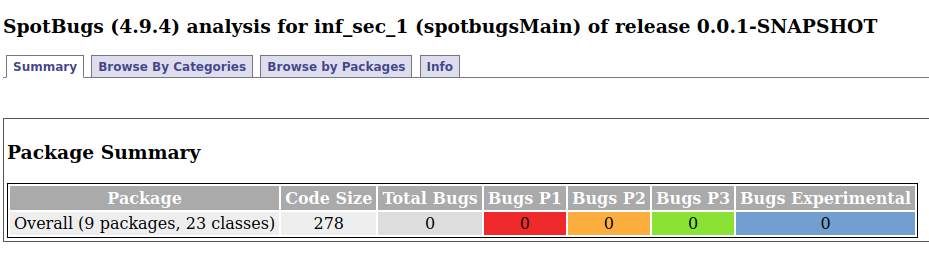
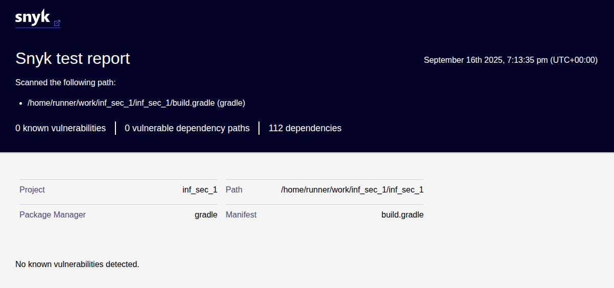

# Лабораторная работа №1 | Информационная безопасность
## Пчелкина Т.П. | Р3411

1. [Описание проекта](#описание-проекта)
2. [API](#api)
3. [Меры защиты](#меры-защиты)
4. [Скриншоты отчетов](#скриншоты-отчетов)

## Описание проекта
В ходе лаборатрной работы был реализован проект с простейшим API для просмотра и сохранения постов. Также реализованы базовые меры защиты (от SQLi, XSS и Broken Authentication)

## API
### Auth API

| Метод | URL          | Описание                         | Пример запроса |
|-------|-------------|---------------------------------|----------------|
| POST  | `/auth/register` | Регистрация нового пользователя | `{ "username": "user", "password": "pass" }` |
| POST  | `/auth/login`    | Аутентификация пользователя     | `{ "username": "user", "password": "pass" }` |

### Posts API

> **Все эндпоинты защищены JWT**, кроме `/auth/**`.

| Метод | URL           | Описание                     |
|-------|--------------|-------------------------------|
| GET   | `/api/data`   | Получение всех постов         |
| POST  | `/api/data`   | Создание нового поста         |
## Меры защиты
Проект содержит несколько уровней защиты от атак и уязвимостей.

Аутентификация и авторизация

1. **Регистрация / логин**

AuthService сравнивает хэш полученного пароля с хэшем, сохранённым в базе (через PasswordEncoder).
При успешной аутентификации создаётся JWT-токен через JwtUtils.generateToken() и возвращается пользователю.

2. **Доступ к защищённым эндпоинтам**
   
Все запросы к /api/** проходят через JwtAuthFilter. Фильтр извлекает заголовок Authorization, проверяет схему Bearer и извлекает токен. JwtUtils.validateToken() проверяет подпись, срок действия токена.
Пользователь помещается в контекст безопасности Spring Security (SecurityContext).

3. **Конфигурация Spring Security**

SecurityConfigсодержит настройку правил доступа к эндпоинтам (/auth/** — открыто, /api/** — требует JWT).

 

 

Защита от SQL Injection

- Все запросы к базе данных через Spring Data JPA / Hibernate.
- Используются параметризованные выражения (Prepared Statements) автоматически.

 

 

Защита от XSS (Cross-Site Scripting)

- Экранирование пользовательского ввода в ответах API.
- Используется HtmlUtils.htmlEscape().

 

 

Безопасность JWT

- Используется алгоритм HMAC-SHA256.
- Токен имеет ограниченное время жизни (1 час).

 

 

Статический анализ и проверка зависимостей

- SpotBugs для выявления потенциальных уязвимостей и багов в коде.
- Snyk для анализа зависимостей на известные CVE.
- CI GitHub Actions автоматически выполняет проверки при каждом пуше или pull request.

## Скриншоты отчетов
### SpotBugs

### Snyk
